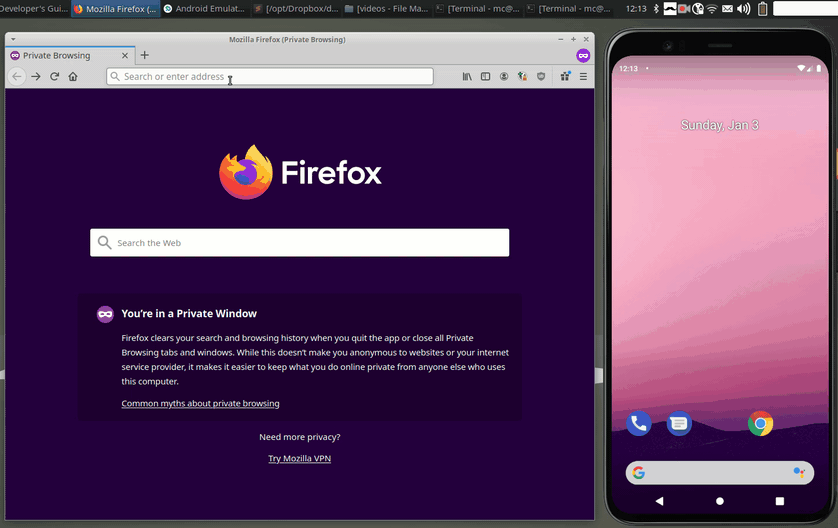

# Clipster - Desktop Client (Go)

  

Clipster is a multi platform cloud clipboard:  
Copy a text on your smartphone and paste it on your desktop, or vice versa.  
Easy, secure, open source.  
Supports Android, Linux, MacOS, Windows and all browsers.   

You can use the web front-end of the public server at [clipster.cc](https://clipster.cc).  
For the Android client see [Clipster-Android](https://github.com/mc51/Clipster-Android).  
To run your own server check [Clipster-Server](https://github.com/mc51/Clipster-Server).  
There is an alternative [Clipster-Desktop](https://github.com/mc51/Clipster-Desktop-Py) implementation written in Python.
  
  
  
## Setup

### Linux 

Download [`clipster_linux.zip`](https://github.com/mc51/Clipster-Desktop/releases/latest/download/clipster_linux.zip) from the latest release, extract and start it.  
To have Clipster auto start, right click on the systray menu and select `Autostart Clipster`.  
  
Clipster depends on gtk-3.0. To install it on  
Ubuntu/Debian:  
`sudo apt-get install libgtk-3-0`  

CentOS/RHEL:  
`sudo yum install gtk3-devel`

### Windows  

Download [`clipster_win.zip`](https://github.com/mc51/Clipster-Desktop/releases/latest/download/clipster_win.zip) from the latest release and extract it. Run `clipster_win.exe` in the `clipster/bin/` folder.  
To have Clipster auto start, right click on the systray menu and select `Autostart Clipster`.  
The `.zip` file comes with GTK-3 files that the GUI depends on. Keep the folder structure under `clipster/` so that the files can be found.  

### MacOS (>=10.13 High Sierra)  

Download [`clipster_mac.zip`](https://github.com/mc51/Clipster-Desktop/releases/latest/download/clipster_mac.zip) from the latest release, extract, move it to `Applications` and start it via `right-click -> open`. You might get a warning message, that you need to ignore. If that fails:
Go to `System Preferences --> Security & Privacy`. In the `General` Tab the App will be listed and you can start it from there.  
  
To have Clipster auto start, right click on the icon in your dock and select `Options --> Open at Login`.  
  
*Notice*: M1 processors (ARM architecture) are not (yet) supported.

## Usage

On the first startup, you can register a new account or enter your existing credentials for the login. Your credentials will be stored in your `HOMEPATH` in `./config/clipster/config.yaml`.  
Clipster will add an Icon to your system tray which you can click for opening up a menu with the following options:  
`Get last Clip` will fetch the last shared Clip from the server and put it into your clipboard.  
`Get all Clips` will fetch all shared Clips from the server and display them to you.  
`Share Clip` will share your current clipboard. Then, it's available for all your devices.  
`Edit Credentials` allows you to register a new account or change your login credentials.  
`Autostart Clipster` will add it to auto start.  
`Quit` will terminate the app.

## Roadmap

- [x] Encrypt / Decrypt clipboard locally and only transmit encrypted data to server
- [x] Add clipboard history: share multiple Clips
- [x] Create Go version
- [x] Add auto start feature
- [x] Switch GUI from goey to gotk3
- [x] Support image sharing

## Contributions

Contributions are very welcome. If you come across a bug, please open an issue. The same thing goes for feature requests.

## Credits

- GUI based on [gotk3](https://github.com/gotk3/gotk3) / GTK3
- [Systray](https://pkg.go.dev/github.com/getlantern/systray) for tray icon and menu
- Notifications using [beep](https://github.com/gen2brain/beeep)
- Config by [Viper](https://github.com/spf13/viper)
- Crypto using [PBKDF2](https://pkg.go.dev/golang.org/x/crypto/pbkdf2) and [Fernet](https://github.com/fernet/fernet-go)
- [Clipboard](https://github.com/golang-design/clipboard) functions
