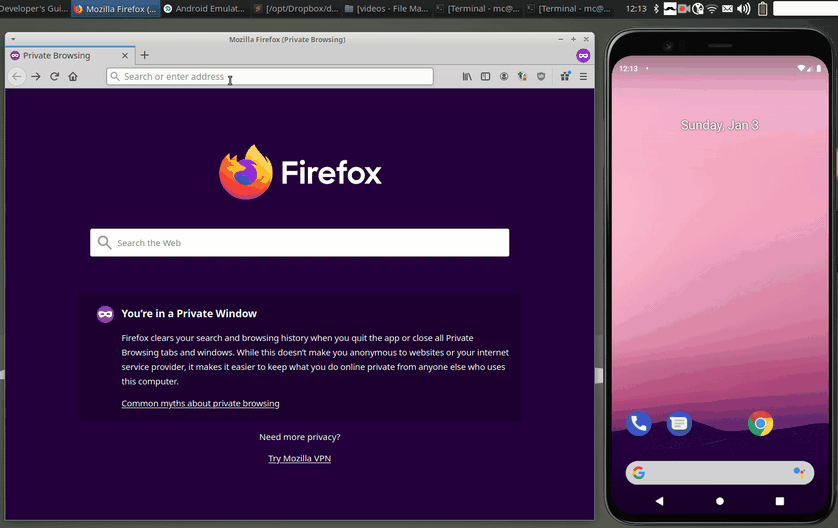

# Clipster - Desktop Client (Go)

[](https://github.com/mc51/Clipster-Desktop/actions)  

Clipster is a multi platform cloud clipboard:  
Copy a text or image on your smartphone and paste it on your desktop, or vice versa.  
Easy, secure, open source.  
Supports Android, Linux, MacOS, Windows and all browsers.   

You can use the web front-end of the public server at [clipster.cc](https://clipster.cc).  
For the Android client see [Clipster-Android](https://github.com/mc51/Clipster-Android).  
To run your own server check [Clipster-Server](https://github.com/mc51/Clipster-Server).  
There is an alternative [Clipster-Desktop](https://github.com/mc51/Clipster-Desktop-Py) implementation written in Python.
  
  
  
## Setup

### Linux

Download [`clipster_linux.zip`](https://github.com/mc51/Clipster-Desktop/releases/latest/download/clipster_linux.zip) from the latest release and extract it. Then either run the binary `clipster/usr/local/bin/clipster` directly, or install it for your user with `make user-install` (or system wide with `sudo make install`) in the extracted `clipster/` folder.  
To have Clipster auto start, right click on the systray menu and select `Autostart Clipster`.  

Clipster only needs OpenGL and X11 or Wayland, which every desktop has. Most distributions have them installed already. If not, on  
Ubuntu/Debian: `sudo apt-get install libgl1 libx11-6 libwayland-client0`  
Fedora/RHEL: `sudo dnf install mesa-libGL libX11 libwayland-client`  

The systray needs StatusNotifier support. On GNOME install the [AppIndicator extension](https://extensions.gnome.org/extension/615/appindicator-support/).

### Windows (>= 10)  

Download [`clipster_win.zip`](https://github.com/mc51/Clipster-Desktop/releases/latest/download/clipster_win.zip) from the latest release, extract it and run `clipster_win.exe`. It is a single file without any dependencies.  
To have Clipster auto start, right click on the systray menu and select `Autostart Clipster`.  

### MacOS (>= 12 Monterey)  

Download [`clipster_mac.zip`](https://github.com/mc51/Clipster-Desktop/releases/latest/download/clipster_mac.zip) from the latest release (works on Apple Silicon and Intel), extract, move it to `Applications` and start it via `right-click -> open`. You might get a warning message, that you need to ignore. If that fails:
Go to `System Preferences --> Security & Privacy`. In the `General` Tab the App will be listed and you can start it from there.  
  
To have Clipster auto start, right click on the icon in your dock and select `Options --> Open at Login`.  

### Build from source

You need Go (see `go.mod` for the version) and a C compiler. On Linux you also need the OpenGL and X11/Wayland development files. On Ubuntu/Debian:

```bash
sudo apt-get install gcc libgl1-mesa-dev xorg-dev libwayland-dev libxkbcommon-dev
go build -o build/clipster .
go test ./...
```

The release packages are created with the [`fyne` tool](https://docs.fyne.io/started/packaging), which is pinned in `go.mod`:

```bash
go tool fyne package --os linux --release     # Clipster.tar.xz
go tool fyne package --os windows --release   # Clipster.exe, can be cross compiled with MinGW
go tool fyne package --os darwin --release    # Clipster.app
```

See the [build workflow](.github/workflows/build.yml) for details, it also repacks them into the `clipster_<os>.zip` release files.

## Usage

On the first startup, you can register a new account or enter your existing credentials for the login. Your credentials will be stored in your home folder in `.config/clipster/config.toml`. Versions before 0.5.0 used `config.yaml` instead, so log in again after updating.  
Clipster will add an Icon to your system tray which you can click for opening up a menu with the following options:  
`Get last Clip` will fetch the last shared Clip from the server and put it into your clipboard.  
`Get all Clips` will fetch all shared Clips from the server and display them to you.  
`Share Clip` will share your current clipboard. Then, it's available for all your devices.  
`Edit Credentials` allows you to register a new account or change your login credentials.  
`Autostart Clipster` will add it to auto start.  
`Quit` will terminate the app.

## Contributions

Contributions are very welcome. If you come across a bug, please open an issue. The same thing goes for feature requests.
